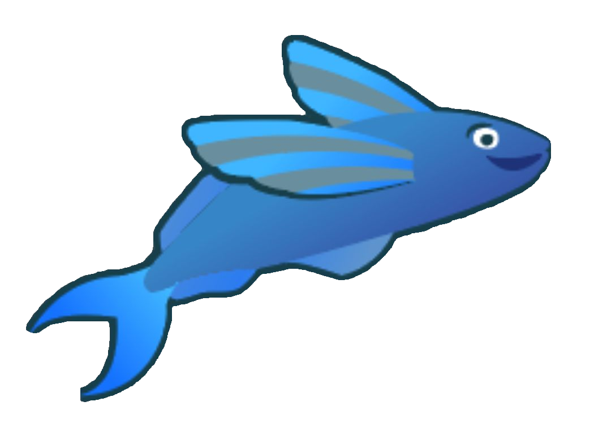

<h1 style="text-align: center; color: lightblue; font-size: 80px"> Mixable <h1/>

<h3 style="text-align: center;">   a <i> multiple inheritance </i> library for js </h3>

<h1>TABLE OF CONTENTS</h1>

<h4>WHY MIXBLE?</h4> 

<h4>GETTING STARTED</h4> 

* SETUP
* USING  

<h4>DETAILS FOR CONTRIUTORS</h4>

* TEST

* HOW IT WORKS

<h1> WHY MIXABLE? </h1>

Mixables is an open source initiative multiple inheritance library.
Which solves the multiple inheritance problem using mixins to move functions.

We want to make it OpenSource because we could not find a better library than ours, and for the chance to grow it and share it with the community.

<h1>GETTING STARTED</h1>

* SETUP  
		How to set up in other peoples projects

* USING 

	Using **createMixableClass()** pass the Class you want as an object in the parameter.
	Include classes to inherit simply in an array. Such as this example

		

		const { createMixableClass } = require('../mixable')  
		const { Flyer } = require('./Flyer.class')  
		const { Swimmer } = require('./Swimmer.class')
	
			
		export const FlyingFish = createMixableClass({
	
		  name: 'FlyingFish',
		  inherits: [ Flyer, Swimmer ],
		  body: class {

	    _constructor() {
	      this.die()
	    }
	  
	    avoidPredator() {
	      this.riseToSurface()
	      this.takeOff()
	      this.land()
	      this.diveDown()
	    }
  
  	The createMixableClass() will automatically create the **multiple inheritance** class.
 
      

<h1>DETAILS FOR CONTRIUTORS</h1>
TEST

The Test file clearly presents the problem we are trying to solve. Lets say you have a class Swimmer that extends Animal. However, the class FlyingFish is both a Swimmer a Flyer and an Animal. Thus we fall into multiple inheritance problem. The “Mixables” package solves multiple inheritance with performance and is easy to use.

